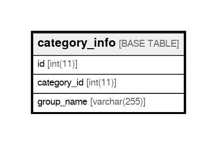

# category_info

## Description

<details>
<summary><strong>Table Definition</strong></summary>

```sql
CREATE TABLE `category_info` (
  `id` int(11) NOT NULL,
  `category_id` int(11) NOT NULL,
  `group_name` varchar(255) NOT NULL,
  PRIMARY KEY (`id`),
  UNIQUE KEY `category_info_category_id_unique` (`category_id`),
  CONSTRAINT `category_info_category_id_foreign` FOREIGN KEY (`category_id`) REFERENCES `categories` (`id`) ON DELETE CASCADE
) ENGINE=InnoDB DEFAULT CHARSET=utf8
```

</details>

## Columns

| Name | Type | Default | Nullable | Children | Parents | Comment |
| ---- | ---- | ------- | -------- | -------- | ------- | ------- |
| id | int(11) |  | false |  |  |  |
| category_id | int(11) |  | false |  |  |  |
| group_name | varchar(255) |  | false |  |  |  |

## Constraints

| Name | Type | Definition |
| ---- | ---- | ---------- |
| category_info_category_id_foreign | UNIQUE | UNIQUE KEY category_info_category_id_foreign (category_id) |
| category_info_category_id_unique | UNIQUE | UNIQUE KEY category_info_category_id_unique (category_id) |
| PRIMARY | PRIMARY KEY | PRIMARY KEY (id) |

## Indexes

| Name | Definition |
| ---- | ---------- |
| PRIMARY | PRIMARY KEY (id) USING BTREE |
| category_info_category_id_unique | UNIQUE KEY category_info_category_id_unique (category_id) USING BTREE |

## Relations



---

> Generated by [tbls](https://github.com/k1LoW/tbls)
